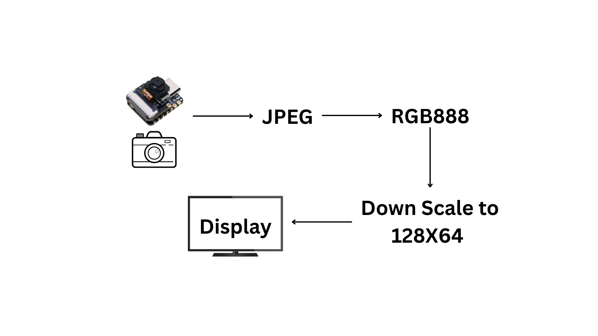

# Image-on-oled-display-
This repo will help you to capture a image from esp-cam and display it on oled display.

# ESP32 XIAO Camera → OLED Image Display

This project demonstrates how to **capture an image using ESP32 XIAO ESP32S3 camera** and **print it on an OLED display** in real-time.  

The captured JPEG is converted to `RGB888`, downscaled, and then displayed as a **128×64 monochrome image** on the OLED screen.  

## 📸 Workflow
1. Press a button → Capture image from XIAO camera.
2. Convert JPEG → RGB888.
3. Downscale to `128x64`.
4. Render on OLED (SSD1306).

## ⚡ Hardware Used
  - Seeed Studio XIAO ESP32S3 (with camera support)
  - OV2640 Camera Module
  - SSD1306 OLED Display (128×64, I2C)
  - Push button (for image capture trigger)

## 🔧 Connections
| ESP32-CAM  | OLED (SSD1306) |
|------------|----------------|
| 3V3        | VCC            | 
| GND        | GND            | 
| SDA        | SDA            | 
| SCL        | SCL            | 
| GPIOxx     | Button         | 

## 🛠️ Code Workflow
  - Button press triggers capture.
  - Camera buffer → decode JPEG.
  - Convert to `RGB888`.
  - Downscale to `128×64`.
  - Display on OLED.

---

📷 Demo
Workflow Diagram:

🚀 How to Run
1. Copy the code.
2. Upload it on your board ( Don't forget to uncomment your board. )
3. press the switch- It will capture the image.
4. And after processing, It will display the image.

⚠️ NOTE: OLED will not show “clear photos,” but a monochrome silhouette/outline of what the camera captures. That’s the limitation of 128×64 SSD1306.
